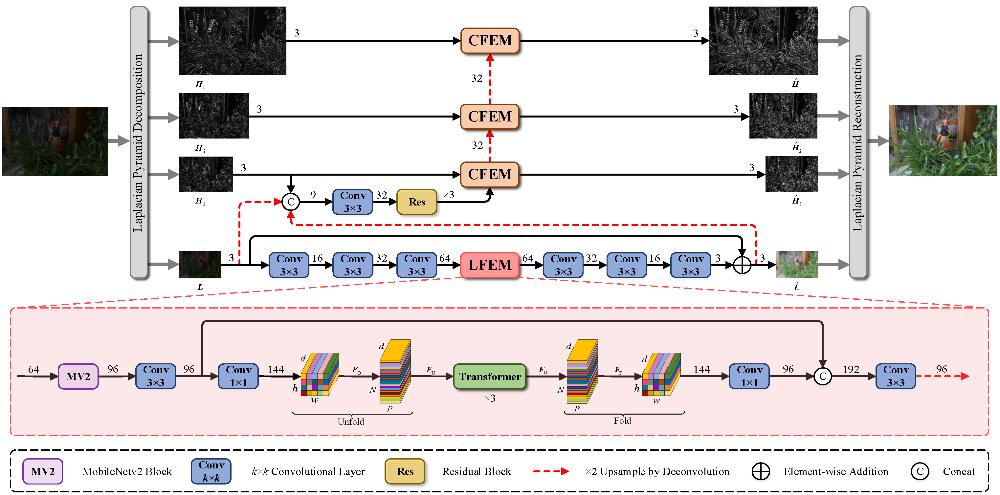

# DLEN
PyTorch code for our paper" DLEN: Deep Laplacian Enhancement Networks for Low-Light Images "
# Introduction
Enhancing low-light images is challenging as it requires simultaneously handling global and local contents. This paper presents a new solution which incorporates the vision transformer (ViT) into Laplacian pyramid and explores cross-layer dependence within the pyramid. It first applies Laplacian pyramid to decompose the low-light image into a low-frequency (LF) component and several high-frequency (HF) components. As the LF component has a low resolution and mainly includes global attributes, ViT is applied on it to explore the interdependence among global contents. Since there exists strong spatial correlation among different frequency components, the refined features from a lower pyramid layer are used to assist the refinement of upperlayer features.

## Dependencies
* python==3.7.5
* torch==1.7.1
* torchvision==0.8.2
* timm==0.2.4
* matplotlib==3.4.3
* tensorboard==2.5.0
* numpy==1.19.5
* scipy==1.7.1
* opencv-python==4.2.0.34

```bash
cd DLEN 
pip install -r ./requirements.txt
```


## Folder structure
Download the datasets and pretrained models first. Please prepare the basic folder structure as follows.

```bash
/parent_folder
  /datasets   # folder for datasets 
    /train/low
    /val/low
    ...
  /DLEN
    /src     # config files for datasets
    /models   # python files for DLEN
    /pretrained_models  # folder for pretrained models
    requirements.txt
    README.md
    ...
```
## Test
### For the evaluation on LOL-v1 and LOL-v2, you should write input_dir with your path on test.py
```bash  
# put datasets and pretrained model in the corresponding directory 
cd DLEN 
python test.py
```
## Train

The source code for training our DLEN will be available after the publication of the paper.
